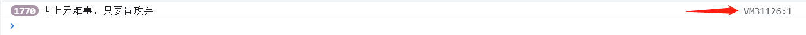
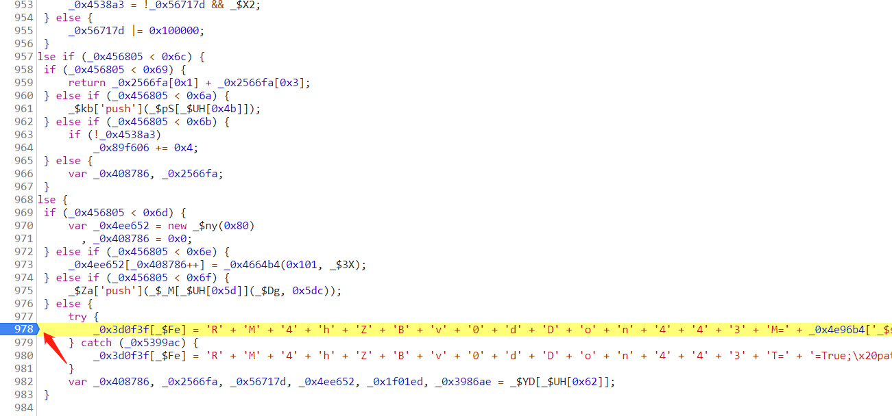
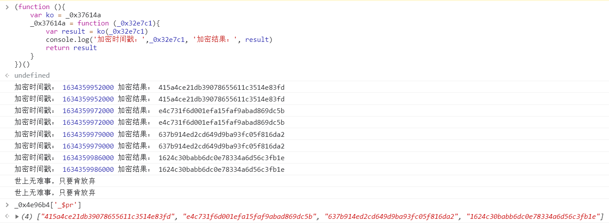

## 猿人学第五题（乱码增强）
> https://match.yuanrenxue.com/match/5  
> 抓取全部5页直播间热度，计算前5名直播间热度的加和  
>  > 第五题的标题 “乱码增强” 就猜测出有代码混淆  
> 页面温馨提示：cookie有效期50秒, 看来本题的难点主要就在cookie
---
### 1.分析
- 通过抓包发现有4个参数每次请求都在变化
  - m (cookie参数)
    - `m=ff74828b4cd39e2ab8bb0912bbfb375c`(32位) --> 猜测是MD5(不是常见的MD5加密, 被修改过)加密的时间戳
  - RM4hZBv0dDon443M (cookie参数)
    - 未知
  - m (url参数)
    - `m: 1634354893158` 应该是时间戳
  - f (url参数)
    - `f: 1634354892000` 应该也是时间戳（但与m的生成方式不同）
---
### 2.js代码还原
> 代码还原需要先找到代码运行的入口, 再逐层还原  
> 可以先全局搜索各个参数名, 但是由于 m、f 过于常见, 匹配的搜索结果太多(无从下手。。。)  
> 搜索 `RM4hZBv0dDon443M` 发现没有匹配的结果, 猜测有可能是拼接字符串, 所以搜不到
- 代码入口

- 点击进去往上翻翻就可以看到代码运行的入口, 找到入口接下来就是打断点和愉快的扣代码😭

- #### 踩坑
  - `_0x4e96b4` 参数在控制台打印输出发现是window对象, 我以为是个检测点(采用jsdom模拟还原js对象), 经过测试直接赋值{}就可以
  - `_0x4e96b4['_$pr']`数组里面放的值时需要AES加密的字符串, 调试发现这些值与cookie中m是同一个加密函数生成的, 传入的时间戳, 时间戳不能写定值, 必须是当前时间戳
  
  - AES加密的 key 是通过btoa(时间戳)取前16位, 调试发现btoa方法传入的时间戳 == m (url参数)
  - `_$UH`是一个长数组（length: 725）,可以使用`copy(array_name)`快速复制
  - python请求时需要将user-agent设置成`'yuanrenxue.project'`
---
### 3.结论
- 代码经过混淆加密
- url参数 `m` 的值是时间戳 == `m (cookie参数)`MD5加密的时间戳
- url参数 `f` 的值是时间戳同时也是cookie过期时间 --> 当前时间戳 - f > 50s --> cookie过期